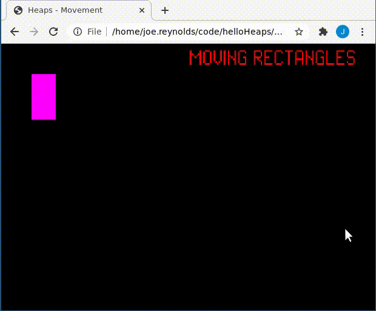
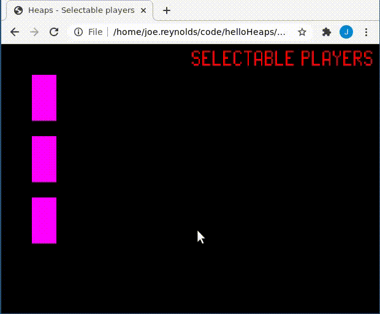
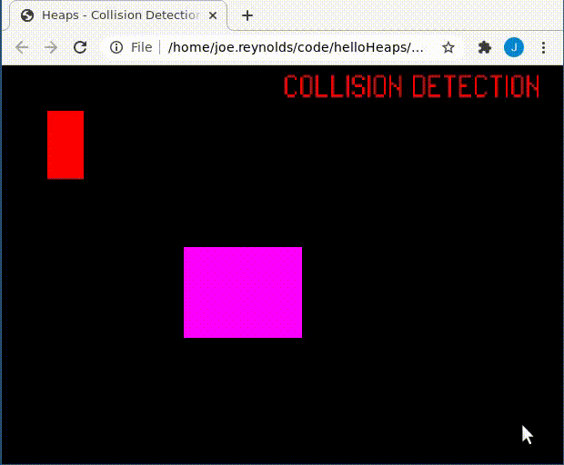
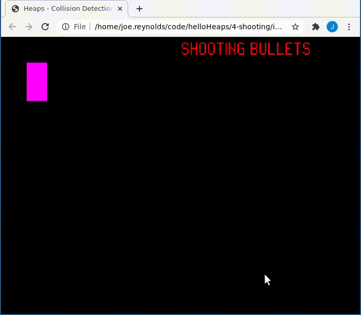
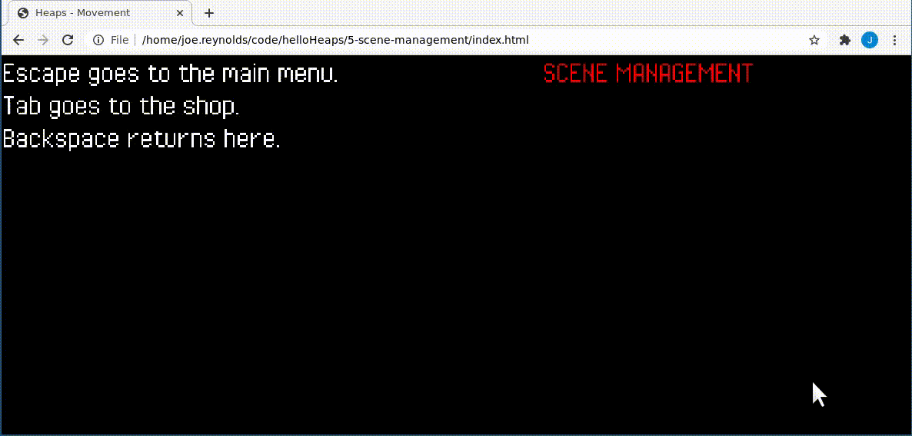

# Haxe + Heaps Examples

I found the docs lacking for some basic things when it came to using
[Heaps](https://heaps.io/).

These are some really basic examples to get you up and running.

These are not progressive examples. I.e. the fourth example is not more
"difficult" than the first.  They're numbered for convenience.

## Running the examples

The examples are already compiled and can be ran by opening the `index.html` in a browser.

If you want to recompile the game for some reason, you can do so with:

```
haxe build.hxml
```

## Examples

### 1-moving-squares



Shows how to properly move a square using the keyboard.  Note the use of delta
time so even on a low frame rate we move consistently.

Also note the use of a vector (`[0, 1]`) for movement instead of hardcoding
player's `x` and `y` coordinates.

### 2-selectable-players



Shows how to have multiple players on the screen and TAB between them. Gives
off some serious [The Lost
Vikings](https://en.wikipedia.org/wiki/The_Lost_Vikings) vibes.

The gist of it is that we create a `playerGroup` and put all of our players
within it and track the active player.

### 3-collision-detection



Simple rectangle collision detection. When the player enters the block, he
turns white.

### 4-shooting



Demonstrates spawning and updating bullets in the Player's direction.

### 5-scene-management



Shows how to switch between different scenes.  E.g. Going from a main menu to
the actual game and into a shop.
